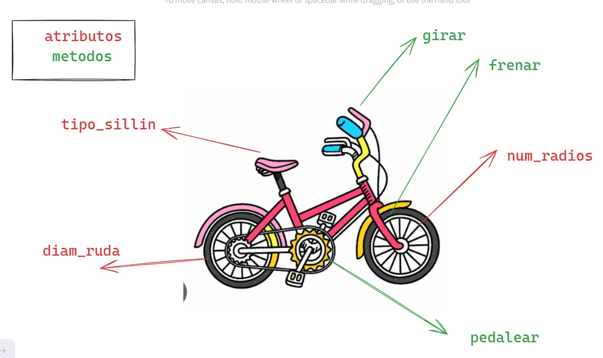
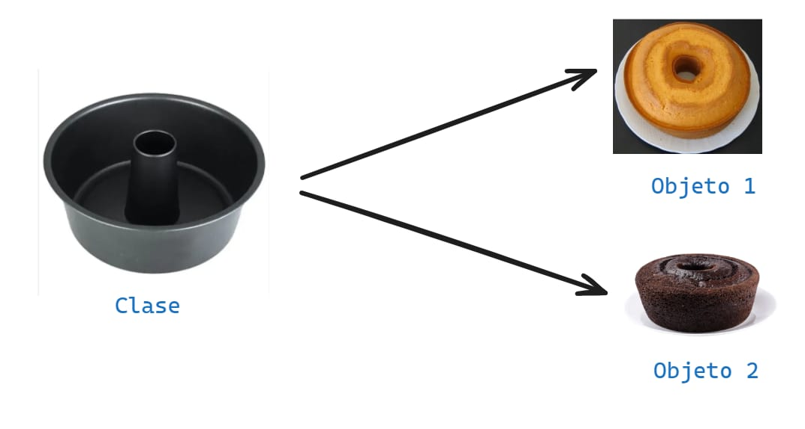

# POO - Programacion orientada a objetos
la programacion orientada a objetos  -`poo` o en sus siglas en ingles `opp`  , es una manera de poogramaar (paradigna), que permite llevar al codigo  mecanismos usados  con entidades de la vida real .
**sus beneficios  son los sigientes**
1. encapsulamiento: permite `enpaquetar` el cogigo dentro de una unidad (ojeto) donde se puede determinar  el ambito de actuacion.
2. abstraccion: permite ` generalizar` los tipos de objestos atrabvez de las clases  y simplificar el programa
3. herencia: permite `reutilixar` codigo al poder eredar atributos ycomportamientos de una clase 
4. polimorfismo:permite`crear` multiples objetos a partor de una misma pieza flexible  de codigo.
exiten 2 mas a nivel educativo no es necesrio aprender aun .
5. aclopamiento
6. cohesion
   ## Que es un objeto
   un `objeto ` es un tipo de datos estructurados que contiene o almacena `datos` y `codigos`. 
   |  Elementos |que son |como se llama |como se identifica |
   |------------|--------|--------------|-------------------|
   |- Dato        |Variable| Atributos    |Mediante sustantivos|
   |- codigo      |funcion |Metodo        |Mediabte verbos    |

   un objeto representa un `instancia unica ` de alguna `entidad` atravez de sus atributos e intyeractuan  con otros objetos o con si  mismo a travez de sus metodos .

   

   ## que es una clase 
   es para crear un `iobjeto` primero debemos definir la `clase ` para responder la pregunta de alex , debemos pensar en la `clase ` como en el molde con el que se crea nuevos objetos .
   en el proceso d diseño  de una clase hay quiem tener en cuenta `el principio de responsabilidad unica ` esto intentanto que los atributos y los `metodos ` esten enfocados en un objetivo un ico y bien defenido.
   
   

>[!TIP]
*Un paradigma de programacion es un metodo , tecnico o estilo  de programar .muchos de los lenguajes de programacion son creados en base  a un paradigma. ejemplom java es un  lenguaje que adopta el paradigma  POO ( programacion orientada a objetos ). sin enbargo  existen lenguajes de programacion  que adoptan varios paradigmas  como es el caso de python y java scrip  estos son lenguajes multiparadigmas .